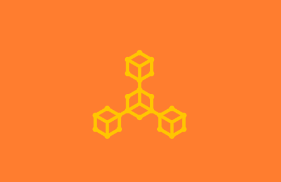

---
weight: 
title: "Aetheras"
description: "Aetheras 旨在通过提供娱乐解决方案，创建改善生活的软件应用"
date: 2022-07-19T21:57:40+08:00
lastmod: 2022-07-19T16:45:40+08:00
draft: false
authors: ["ovorr"]
featuredImage: "aetheras.jpg"
link: "https://www.aetheras.io/"
tags: ["研究机构","Aetheras"]
categories: ["navigation"]
navigation: ["研究机构"]
lightgallery: true
toc: true
pinned: false
recommend: false
recommend1: false
---
**Aetheras** 旨在通过提供娱乐解决方案，创建改善生活的软件应用。他们的首个项目是内部开发的区块链，以服务于游戏行业的交易市场。

**Agence**是一个以游戏资产为中心的平台，旨在提供一种连接游戏虚拟世界的方式。

**基于区块链**使用区块链技术，Agence保证了区块链固有的公平和透明。在链上存储数据将确保数据不会被更改。

**游戏联盟**随着资产数据的存储和随时可从链中访问，对游戏来说，协作和支持彼此的数据变得很简单。

**数据谱系关系**在Agence下，玩家拥有他们的资产数据。无论游戏是集中式还是分散式，数据都是给玩家保管和使用的。

