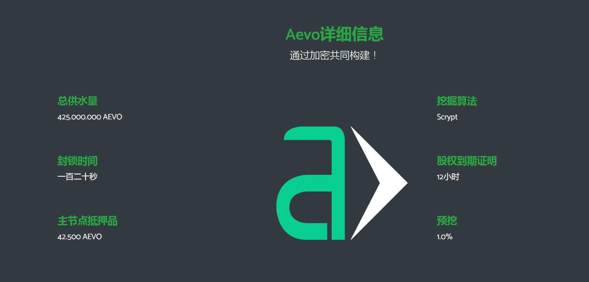

---
weight: 
title: "Aevocoin Explorer"
description: "Aevocoin Explorer是Aevocoin代币的官方浏览器，提供区块查询，地址查询，交易查询等功能"
date: 2022-07-19T21:57:40+08:00
lastmod: 2022-07-19T16:45:40+08:00
draft: false
authors: ["ovorr"]
featuredImage: "aevocoin-explorer.png"
link: "https://aevocoincommunity.github.io/aevo-site/"
tags: ["区块链浏览器","Aevocoin Explorer"]
categories: ["navigation"]
navigation: ["区块链浏览器"]
lightgallery: true
toc: true
pinned: false
recommend: false
recommend1: false
---
**Aevocoin Explorer**是Aevocoin代币的官方浏览器，提供区块查询，地址查询，交易查询等功能。

**Aevo硬币**: 一个社区位置/功率/MN带有奖励主节点系统的硬币

1.该网络通过电力和赌注来保护，同时使用激励性的“主节点”来提供即时交易和治理等服务。每一个都需要42.500 AEVO作为抵押。他们获得75%的整体奖励。25%归赌注者。

2.使用Darksend使你的支付保持私密和不可追踪。

3.Aevo对其网络)使用Scrypt哈希算法，提供最大的安全性和稳定性。

