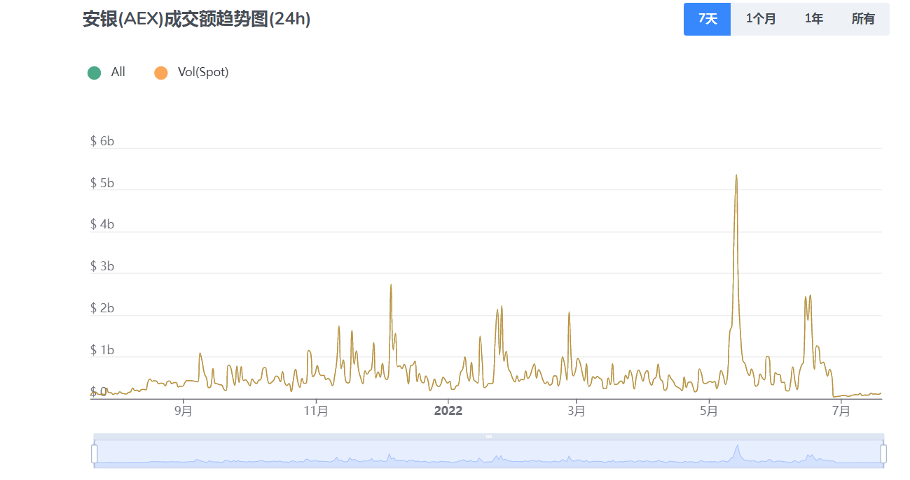
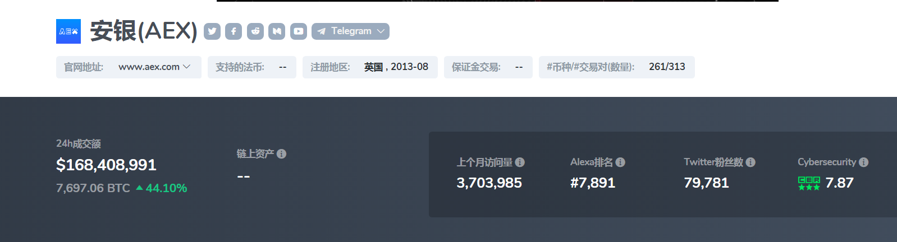

---
weight: 
title: "AEX交易所"
description: "Bit.cc注册于英国，是Bit World Investments Limited所运营的一家平台，提供区块链技术服务及数字资产交易。"
date: 2022-07-19T21:57:40+08:00
lastmod: 2022-07-19T16:45:40+08:00
draft: false
authors: ["ovorr"]
featuredImage: "aexjiaoyisuo.webp"
link: "https://www.aex.com/"
tags: ["交易所","AEX交易所"]
categories: ["navigation"]
navigation: ["交易所"]
lightgallery: true
toc: true
pinned: false
recommend: false
recommend1: false
---
**AEX**，六年老牌资深国际站，集资讯社区、交易及金融理财服务为一体，拥有严格的资金管理系统，实行100%准备金制度，平台资金流向公开透明，已上线上百个交易对，用户注册数量近百万，在全球范围内拥有良好的业界口碑，被用户誉为业界最有良心的国际站。AEX致力于做用户最值得信赖的数字资产综合服务平台，不仅安全、稳定、高效、更贴心。

AEX成立于2013年，是最早一批全球专业的中心化数字资产交易平台之一。 AEX主要面向中国市场。近年来，随着市场规模的增长和各种加密货币衍生品的出现，AEX逐渐从早期的撮合交易定位，向着全球数字资产商业银行的方向发展和转型，倡导安全投资和稳步升值。 AEX 报告的 24 小时交易量超过 1.5 亿美元，估计实际交易量为 1 亿美元。 AEX自成立以来，秉持中立、安全投资、稳定增值的原则。

AEX交易所位于中国，由Bit World Investments Limited运营。而且也是在英国注册的。创始人兼CEO黄天伟，深圳市区块链与信息服务行业协会常务副会长。

**AEX交易所的主要特点**

- 透明运作：AEX坚持中立不作恶的原则，平台资金流向透明。所有业务数据都将透明化。设立专属资产管理岗位，开展透明化工作。
- 衍生服务：AEX团队快速及时反馈市场需求，AEX推出衍生服务，包括DeFi板块、NFT板块、DOT生态、DAO、DeFi金库矿池挖矿、ETH联合挖矿等。
- 抵押：AEX抵押是AEX提供的加密资产质押借贷业务，可以通过数字货币质押获得短期流动性。
- DeFi挖矿：AEX支持一键挖矿，无GAS费用

 